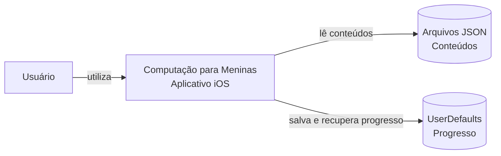
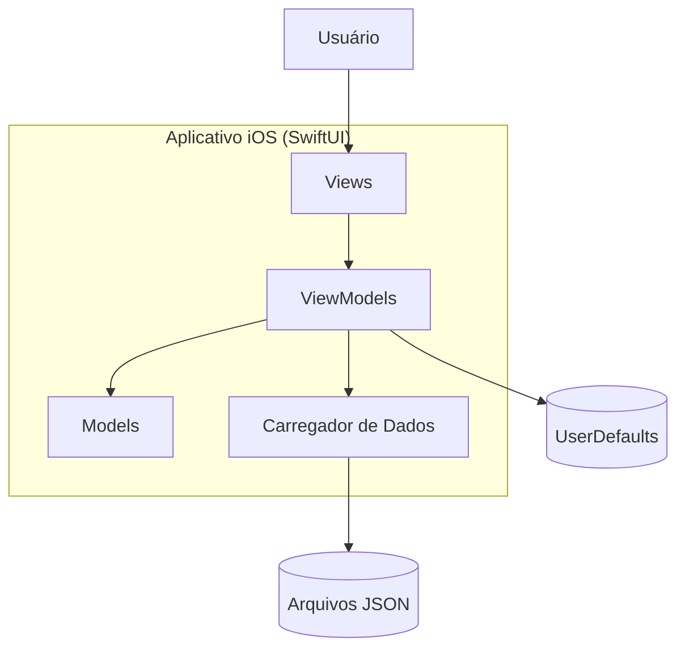
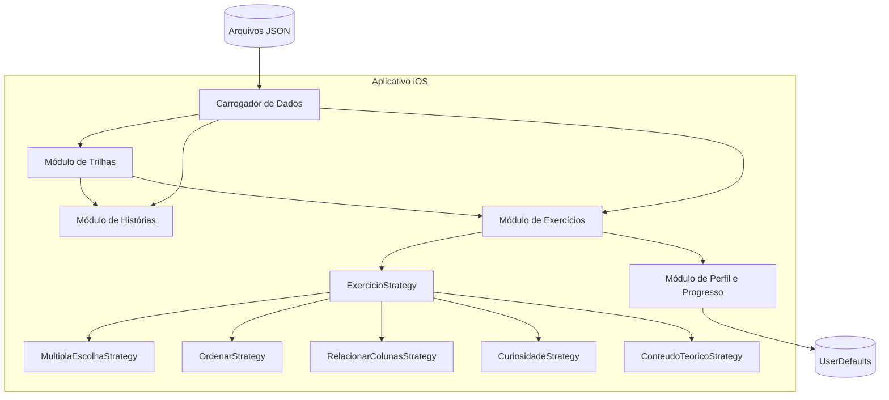

# Computação para Meninas

Trabalho de MC656 que visa democratizar o ensino de computação para meninas e mulheres. Buscamos desenvolver esse aplicativo com base nas ODS 4 e 5.

## Teste e execução do projeto

Projeto SwiftUI configurado com XcodeGen para gerar o .xcodeproj de forma consistente e evitar conflitos de configuração.

```bash
# Instale xcodegen (caso já não tenha instalado)
$ brew install xcodegen

# Clone o repositório
$ git clone https://github.com/anamargaridaborges/computacao-para-meninas

# Acesse a pasta com o project.yml
$ cd computacao-para-meninas/computacao-para-meninas

# Build do .xcodeproj utilizando xcodegen
$ xcodegen generate

# Abra com Xcode
$ open computacao-para-meninas.xcodeproj

# Rode em um simulador :)

```

# Arquitetura

## Estilo Arquitetural

O estilo arquitetural adotado no projeto foi o MVVM (Model-View-ViewModel), amplamente utilizado em aplicações desenvolvidas com SwiftUI. Essa arquitetura organiza o sistema em camadas com responsabilidades bem definidas, separando a interface gráfica da lógica de negócio e do gerenciamento dos dados.


- **Model:** representa as entidades da aplicação e os dados utilizados pelo sistema, incluindo módulos de aprendizagem, histórias interativas, exercícios, progresso do usuário e demais estruturas carregadas a partir dos arquivos JSON

- **View:** corresponde às telas da aplicação, implementadas em SwiftUI. São responsáveis por apresentar as trilhas, histórias, exercícios e informações de progresso ao usuário, reagindo automaticamente às mudanças de estado fornecidas pelos ViewModels.

- **ViewModel:** concentra a lógica de cada funcionalidade da aplicação. É responsável por carregar os conteúdos, controlar o fluxo entre as telas, processar as interações do usuário, validar respostas dos exercícios e atualizar o progresso apresentado na interface.

Além da estrutura MVVM, a arquitetura utiliza um componente responsável pela leitura e decodificação dos arquivos JSON que armazenam os conteúdos da plataforma, permitindo que módulos, histórias e exercícios sejam carregados dinamicamente. O sistema também utiliza o UserDefaults para persistir informações de progresso do usuário entre diferentes sessões de uso.
A adoção dessa arquitetura permitiu organizar o projeto em componentes com responsabilidades bem definidas, reduzindo o acoplamento entre interface, lógica de negócio e dados. Isso facilita a manutenção do código, a evolução da aplicação e a adição de novos módulos, histórias ou tipos de exercícios com impacto reduzido nas demais partes do sistema.


---

## Diagramas C4

### Contexto



### Containers



### Componentes



---

## Principais componentes e responsabilidades

### Módulo de Trilhas

Gerencia a organização do conteúdo educacional da aplicação. É responsável por exibir os módulos disponíveis, controlar a navegação entre as trilhas de aprendizagem e liberar o acesso às atividades conforme o progresso do usuário.

### Módulo de Exercícios

Gerencia a execução das atividades propostas ao usuário. Seleciona dinamicamente o tipo de exercício adequado (como múltipla escolha, ordenação, associação de colunas, curiosidades e conteúdo teórico), valida as respostas, fornece feedback e registra o progresso obtido em cada atividade.

### Módulo de Histórias

Controla a apresentação das histórias interativas utilizadas para contextualizar o conteúdo. É responsável por carregar os diálogos, gerenciar a sequência narrativa, exibir personagens e permitir o avanço da história de acordo com as interações do usuário.

### Módulo de Perfil e Progresso

Gerencia as informações do usuário, incluindo o acompanhamento do progresso nas trilhas, a conclusão de atividades e a persistência desses dados localmente, permitindo que o usuário continue seus estudos de onde parou.

### Carregador de Dados

Realiza a leitura e a decodificação dos arquivos JSON que armazenam os módulos, exercícios, histórias e demais conteúdos da aplicação, disponibilizando essas informações para os ViewModels e garantindo que as telas sejam preenchidas dinamicamente sem dependência de dados fixos no código.

---

## Padrão de Projeto

Foi adotado o padrão de projeto **Strategy** para representar os diferentes tipos de exercícios disponíveis na aplicação.

A interface `ExercicioStrategy` define uma operação comum para criação da interface de um exercício. Cada implementação concreta (`MultiplaEscolhaStrategy`, `OrdenarStrategy`, `RelacionarColunasStrategy`, `CuriosidadeStrategy` e `ConteudoTeoricoStrategy`) encapsula toda a lógica necessária para inicializar sua respectiva View e ViewModel.

Dessa forma, a classe responsável pelo fluxo geral dos exercícios (`ExercicioGeralView`) não precisa conhecer detalhes de implementação de cada tipo de exercício, apenas solicita que a estratégia correspondente crie a interface adequada. Essa abordagem reduz o acoplamento, facilita a manutenção do código e permite adicionar novos tipos de exercícios sem alterar a lógica existente, respeitando o princípio **Open/Closed**.
