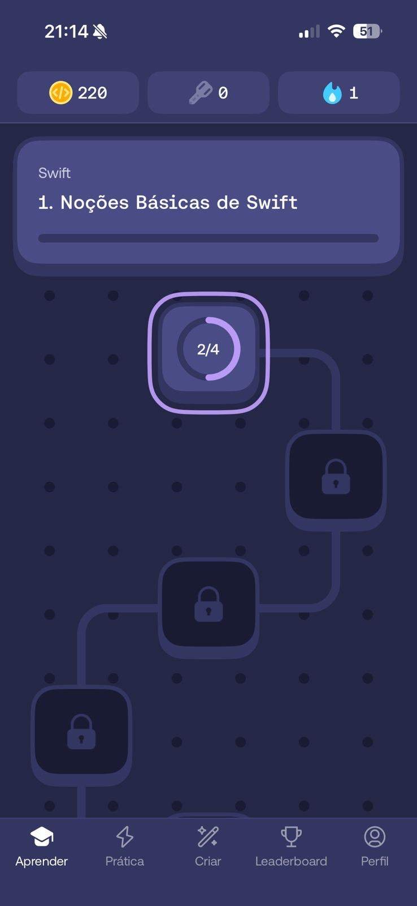
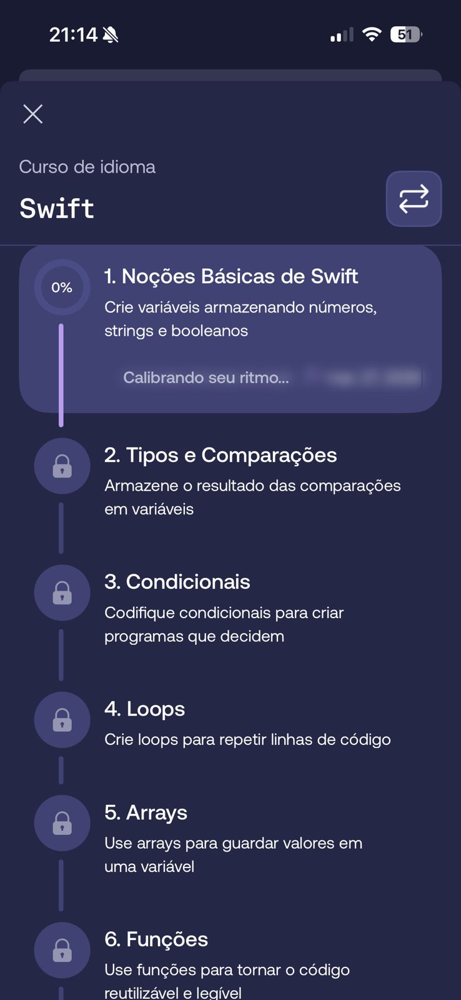
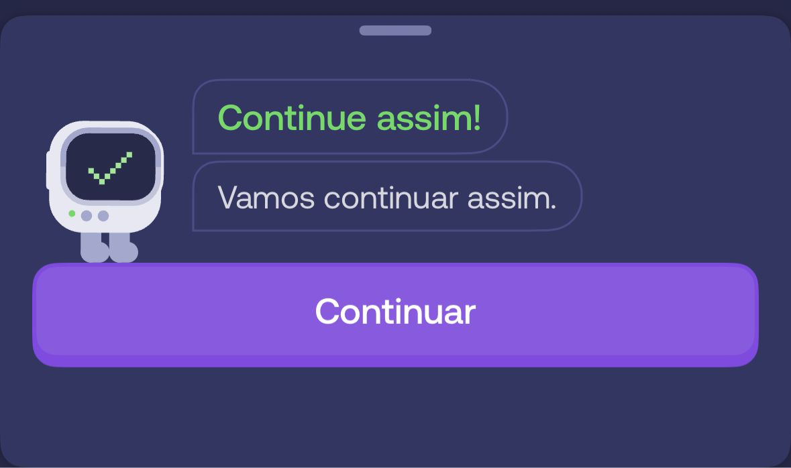
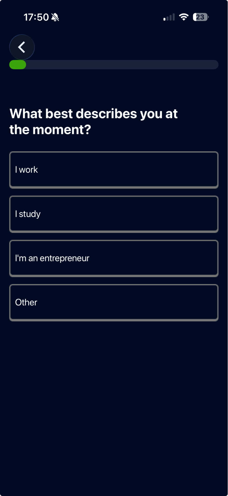
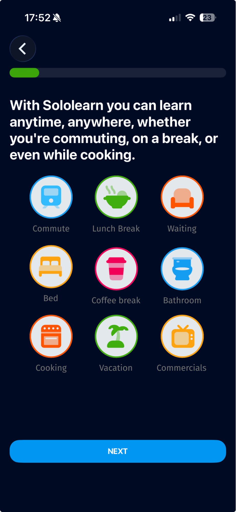
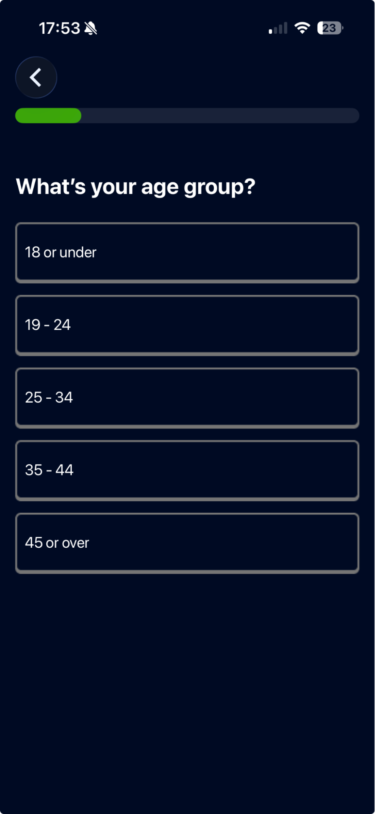
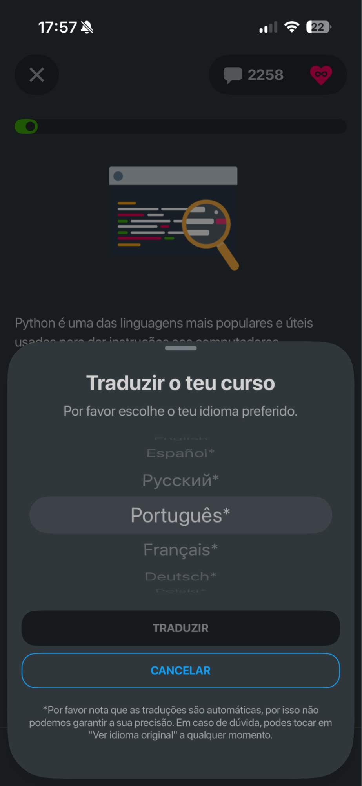
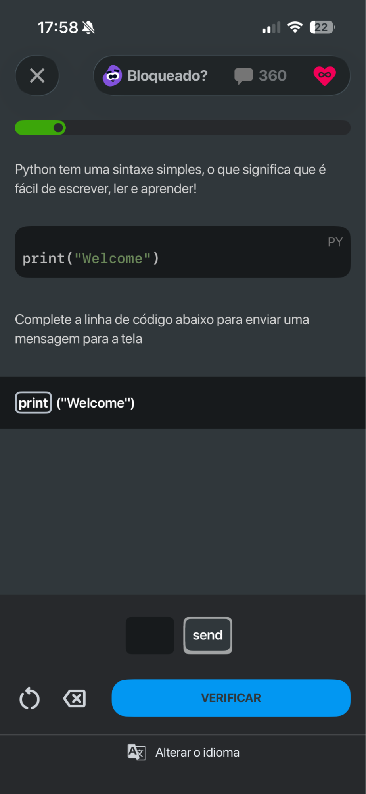
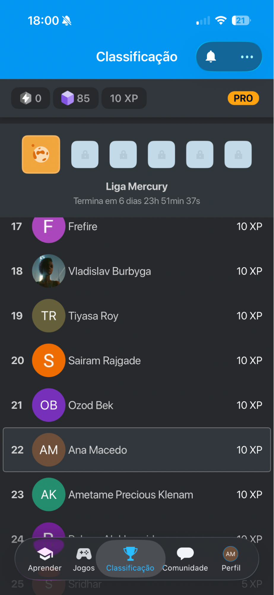
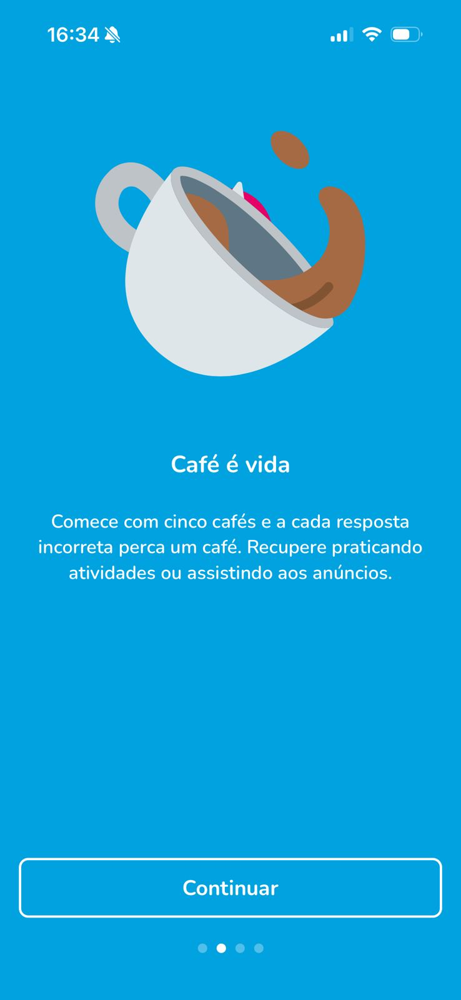

# **Elicitação de Requisitos**

## **Benchmarking**

### **1. Mimo**

Mimo é um aplicativo voltado para o ensino de programação de forma lúdica e interativa. Ele ensina conceitos de Python, JavaScript, HTML, CSS, SQL, entre outros. Abaixo estão algumas funcionalidades que o app apresenta:

- Questionário inicial para conhecer melhor o usuário e personalizar o que ele quer aprender.

  
  
  

- Contagem de quantos dias o usuário permaneceu ativo no app fazendo as atividades.

  

- Ranking de usuários baseado na pontuação obtida em atividades realizadas.
 

  

    
- Recompensas por cada atividade realizada.

  

- Diferentes trilhas com atividades relacionadas a um tema específico.
 

  
  

    
- Sistema de vidas que limita as tentativas disponíveis para as atividades.
 

  
  

    
- Animações usadas para guiar interações, fornecer feedbacks visuais e reforçar a identidade visual do app.
 

  
  
  
  
  

**Pontos positivos:**

- Conteúdos ensinados de forma simples   
- Feedbacks a cada resposta do usuário nas atividades  
- Diversas trilhas com diferentes tipos de atividades  
- Interface bem explicativa e de fácil usabilidade

**Pontos negativos:** 

- vidas limitadas a 2 atividades por dia

---

### **2. Sololearning**

É um app que ensina mais de 20 linguagens de forma prática, como Python, JavaScript, SQL, Java, C\# etc, utilizando IA para dicas durante as lições e com um certificado compartilhável no LinkedIn. 

- Onboarding inicial para entender o usuário e explicar a proposta.

  
  
  

- Para utilizar o app, é necessário realizar uma assinatura com 24h de teste gratuito.

  

- Tem algumas animações durante o fluxo para motivar o usuário, bem carregadas.

  

- É apresentada a opção de tradução logo na primeira lição, com diversas opções de idiomas e é atualizado automaticamente. Porém, até essa parte, o app é inteiramente em inglês.

  

- Nas lições, o modelo segue o tradicional de ter várias lições em uma sequência. É possível pedir para a IA alguma dica, caracterizada pelo personagem roxo, mas precisa “pagar” com os bits (moedas do jogo) que você recebe quando assina e ao terminar as lições.

  
  
  

- Ao terminar a lição, tem um resumo rápido do que foi aprendido e uma chamada para continuação do aprendizado.

  

- Tem contagem de dias que o usuário entrou, como uma ofensiva, notificações, aba de cursos separada por assunto.
 

  
  
  

- Possui um ranking de acordo com o xp adquirido e uma aba de comunidade onde os usuários podem discutir dúvidas, mostrarem seus projetos e um feed onde o Sololearngin posta novidades, mas não tem posts da comunidade em si.

  
  

- Além de todos esses recursos, o app também possui um jogo de caçar bugs disponível em três linguagens: python, SQL e JavaScript.

  

**Pontos positivos:**

- Conteúdo muito completo, atualizado e apresentado de forma didática.  
- Aplicativo muito completo, com várias funcionalidades para explorar  
- Suporte para muitas linguagens e habilidades importantes para software

**Pontos negativos:**

- Fluxo de usuário confuso, com muitos caminhos longos e funções escondidas  
- É completo, mas possui funcionalidades demais, o que deixa com um propósito perdido  
- Telas com muitas informações dispostas de forma confusa

---

3. Motiro

	Motiro é um aplicativo de aprendizado de programação, voltado para o JavaScript. Nele, o usuário aprende por meio da realização de exercícios, principalmente, mas também há a opção de ler conteúdo teórico. Abaixo estão algumas de suas principais funcionalidades: 

- A cada erro, o usuário perde uma “vida”.

  

- O usuário participa de um ranking e sobe nele ao ganhar XP. O XP pode ser ganho na realização de atividades.

  
  

- O conteúdo teórico também é disponibilizado no aplicativo.

  
  

- Há uma ofensiva de ensino, ou seja, uma sequência de dias em que o usuário fez atividades no app.

  

- Dois principais tipos de atividades são disponibilizados: múltipla escolha e escrever código.

  
  

**Pontos positivos:**

- Disponibiliza explicações teóricas caso os exercícios não sejam o suficiente para aprender bem;  
- Explica conceitos abstratos da computação (como entrada e saída) de forma simples e com exemplos;  
- Possui elementos de gamificação (como ofensiva e ranking) que engajam o usuário.

**Pontos negativos:**

- Os elementos de UI para engajar o usuário (como animações e sons) não são muito bons e nem muito presentes;  
- Possui apenas uma trilha, que é a trilha de JavaScript;  
- Possui vidas, que limitam a quantidade de conteúdo aprendida no aplicativo. 
