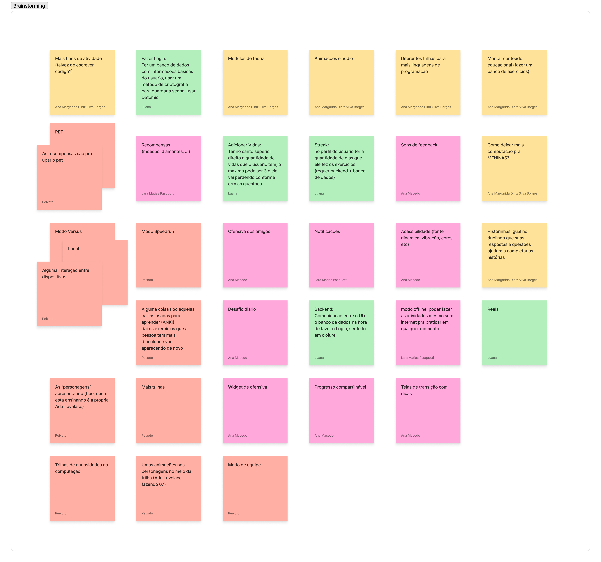
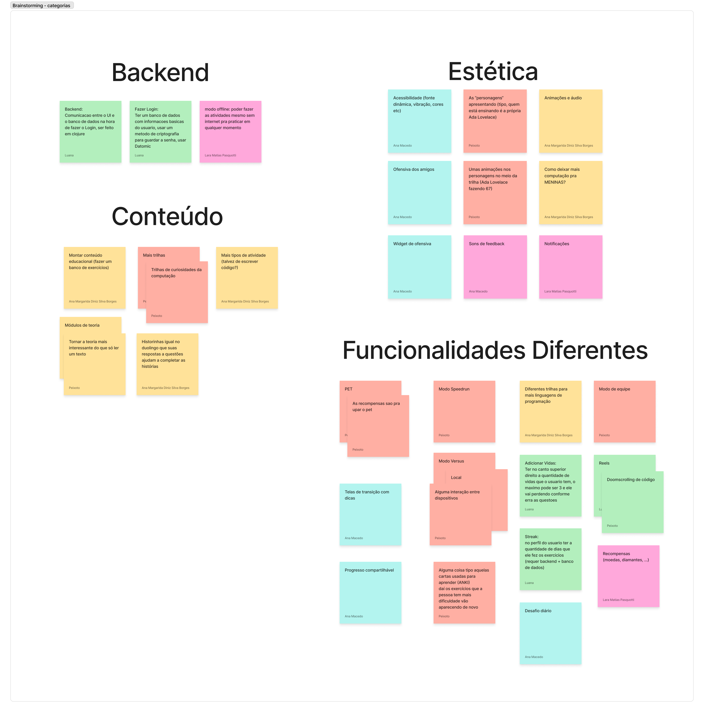
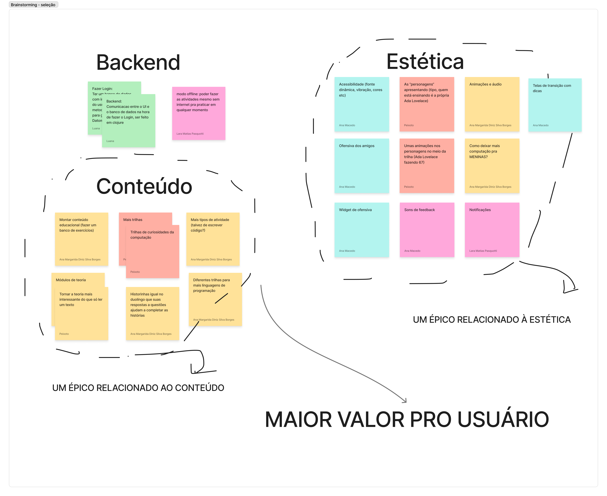
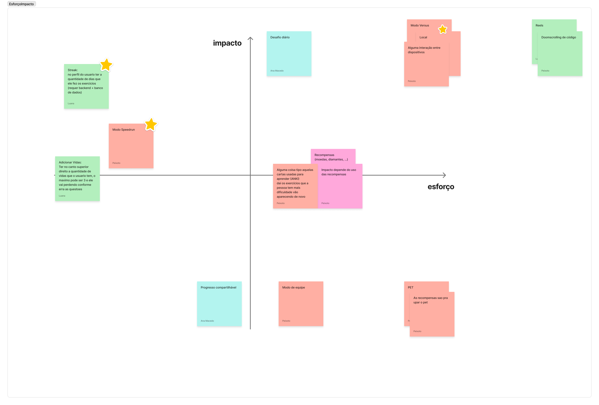

# **Elicitação de Requisitos**

## **Brainstorming**

Fizemos uma sessão de brainstorming presencialmente, mas utilizando o figmajam da seguinte maneira:

### **1. Primeiramente fizemos uma sessão de 10 minutos colocando todas nossas ideias, sem julgamento em um quadro.**

  

### **2. Posteriormente, discutimos, analisamos e agrupamos as ideias que tivemos**

  

### **3. A partir disso, percebemos 2 épicos claros, que traziam muito valor ao usuário**
- Épico de estética
- Épico de Conteúdo (Sendo esse o mais importante)

  

### **4. Além disso percebemos que precisariamos de algumas funcionalidades diferentes para tornar o app mais atrativo**
- Por isso, fizemos uma matriz de esforço impacto, para decidir quais funcionalides fariam parte de próximos épicos

  

